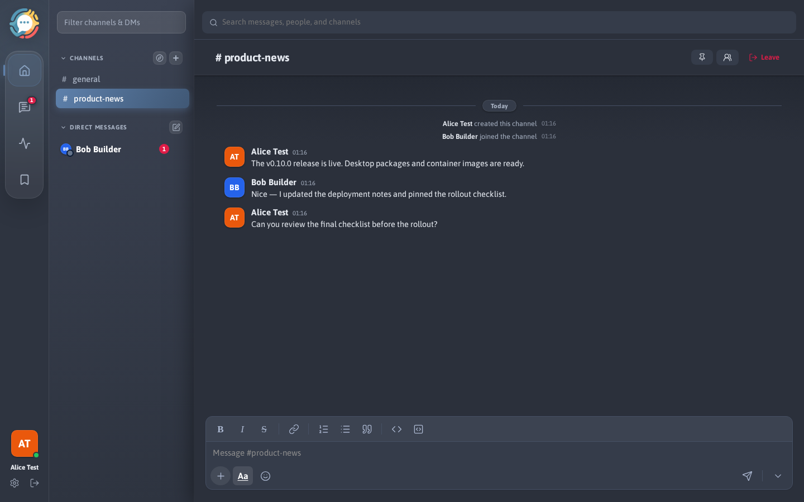
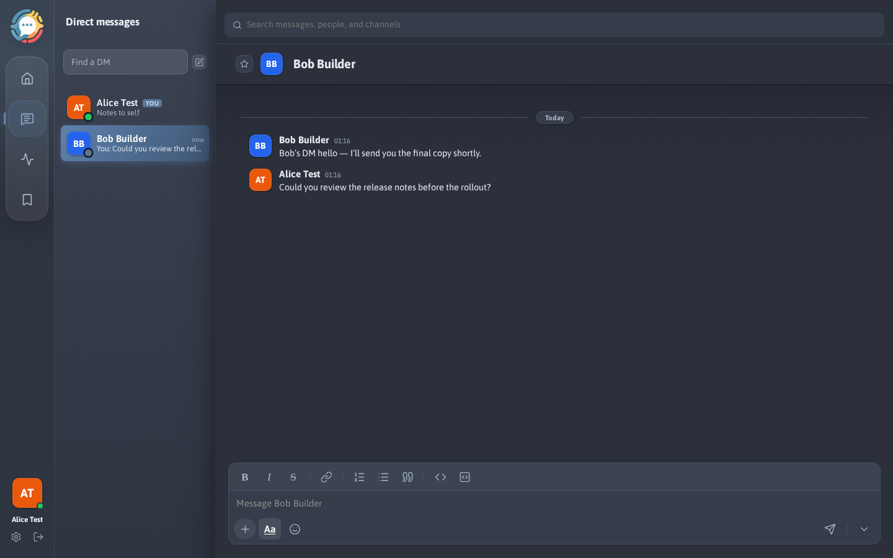
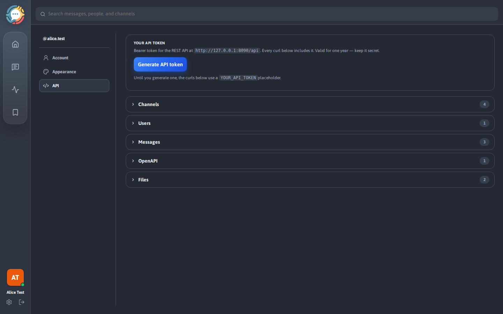

<p align="center">
  
</p>

<h1 align="center">Echo</h1>

<p align="center">A self-hosted communication workspace for teams that want fast collaboration and control of their data.</p>

<p align="center">
  Channels · DMs · threads · files · search · web and desktop clients
</p>

## Highlights

- Public and private channels, direct messages, threads, mentions, reactions, pins, and saved messages.
- Rich messages with Markdown, code blocks, emoji, uploads, forwarding, and scheduled delivery.
- Search across messages, people, and channels, plus activity and saved-message views.
- Selectable incoming-message sounds stored locally for fully offline playback.
- API tokens, incoming webhooks, and an in-app OpenAPI reference.
- Docker Compose and Helm deployments with MongoDB and S3-compatible storage.
- Responsive web UI and Electron desktop apps with automatic updates.

## Screenshots

The screenshots below reflect the current Echo interface and branding.


### Workspace



### Direct messages



### API reference



## Quick start

Requirements: Docker with Compose.

```bash
docker compose up -d --build --scale server=3
```

Open [http://localhost:8090](http://localhost:8090). The first account created becomes the workspace administrator.

For the RHSSO demo:

```bash
docker compose -p echo-rhsso-demo -f docker-compose.rhsso.yml up -d --build
```

Then open [http://localhost:8091](http://localhost:8091), create the local `admin` account, and choose **Sign in with RHSSO**. The demo user is `jane.doe` / `UserPassword1`; the Keycloak console is available at [http://localhost:8180](http://localhost:8180) with `admin` / `AdminPassword1`.

To run the RHSSO end-to-end suites locally, build the desktop renderer and run
the browser and Electron tests against that stack:

```bash
npm --prefix client install
npm --prefix electron install
ELECTRON_BUILD=1 npm --prefix client run build
ECHO_URL=http://localhost:8091 npm --prefix client run test:e2e:rhsso
ECHO_URL=http://localhost:8091 npm --prefix electron run test:e2e:rhsso
```

On a headless Linux machine, wrap the Electron command with `xvfb-run --auto-servernum`.

Stop the demo and remove its data with:

```bash
docker compose -p echo-rhsso-demo -f docker-compose.rhsso.yml down -v
```

## Configuration

Compose includes development defaults. Set strong values before sharing a deployment:

```bash
JWT_SECRET=change-me
MINIO_ROOT_USER=echo
MINIO_ROOT_PASSWORD=change-me
```

Useful defaults:

| Service | URL |
| --- | --- |
| Client | `http://localhost:8090` |
| Server API (Compose network) | `http://server:4000` |
| MongoDB | `mongodb://mongo:27017/echo?replicaSet=rs0` |
| MinIO (Compose network) | `http://minio:9000` |

Set `MONGO_URI` to use an external MongoDB replica set or cluster. Set `ECHO_PUBLIC_HOST` when the RHSSO demo is accessed from another machine.

## Development

Run the UI against the Docker services:

```bash
JWT_SECRET=change-me ./scripts/dev-ui.sh
```

The Vite app is then available at [http://localhost:5173](http://localhost:5173). To run packages separately:

```bash
(cd server && npm install && npm run dev)
(cd client && npm install && npm run dev)
```

Run checks with:

```bash
(cd server && npm test && npm run build)
(cd client && npm test && npm run build)
```

### Message sounds

Echo includes five selectable notification sounds: **Bright pop**, **Short alert**, **Clear ding**, **Soft chime**, and **Warm bell**. They are bundled WAV files from OpenGameArt under the [CC0 1.0 Universal public-domain dedication](https://creativecommons.org/publicdomain/zero/1.0/), so playback works offline in both the web and desktop clients. Exact creators, source pages, original filenames, and download dates are recorded in `client/THIRD-PARTY-LICENSES/Message-Sounds-LICENSE.txt`.

To add another sound:

1. Add its identifier, label, and description to `MESSAGE_SOUNDS` in `client/src/lib/messageSounds.ts`.
2. Add the audio file under `client/src/assets/sounds/` and reference it with `new URL(..., import.meta.url)` in the sound definition.
3. Record the creator, exact source page, original filename, license, and download date in `client/THIRD-PARTY-LICENSES/`. Only include files whose individual source entry permits redistribution; CC0 is preferred.
4. Preview it from **Settings → Preferences → Message sounds**, then verify incoming-message playback and the one-second cooldown.
5. Run the client tests and both the normal web and Electron builds before rebuilding the client service.

## Deployment

The [Helm chart](helm/echo) can deploy Echo with bundled MongoDB and MinIO, or connect to existing services. Disable bundled dependencies with `mongodb.enabled=false` and `minio.enabled=false`, then configure `server.mongoUri` and the server S3 settings.

For air-gapped environments, transfer the required container images and chart packages into the target network. Echo does not require external API calls for normal chat, uploads, or search.

Prebuilt desktop packages and versioned deployment artifacts are published on the [Releases](https://github.com/ArielBerkovich/Echo/releases) page.

## API

Sign in, open **API** from the lower-left rail, generate a token, and copy the ready-to-run curl examples for channels, messages, users, files, and webhooks. Messages can be sent directly by channel name or username:

```text
POST /api/channels/general/messages
POST /api/users/bob.builder/messages
```

## Repository layout

```text
client/             React + Vite web client
electron/            Electron desktop shell
server/              Express + Socket.IO API
helm/echo/           Self-contained Helm chart
docker-compose.yml   Local deployment stack
docs/images/         README screenshots
```

## License

See [LICENSE](LICENSE).
